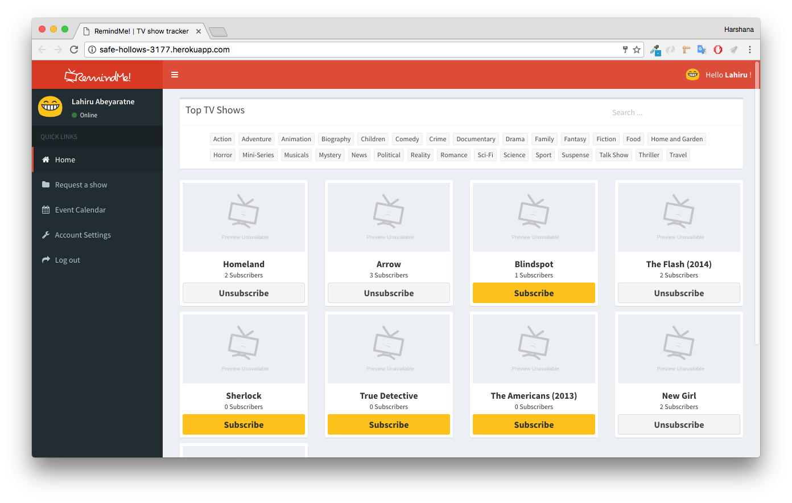
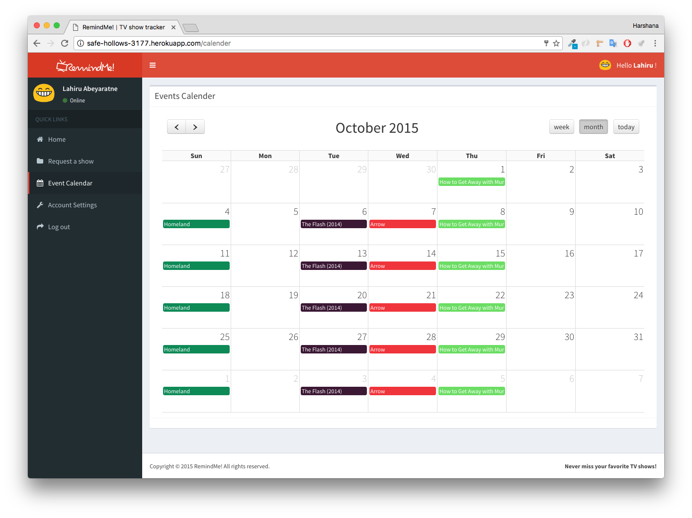
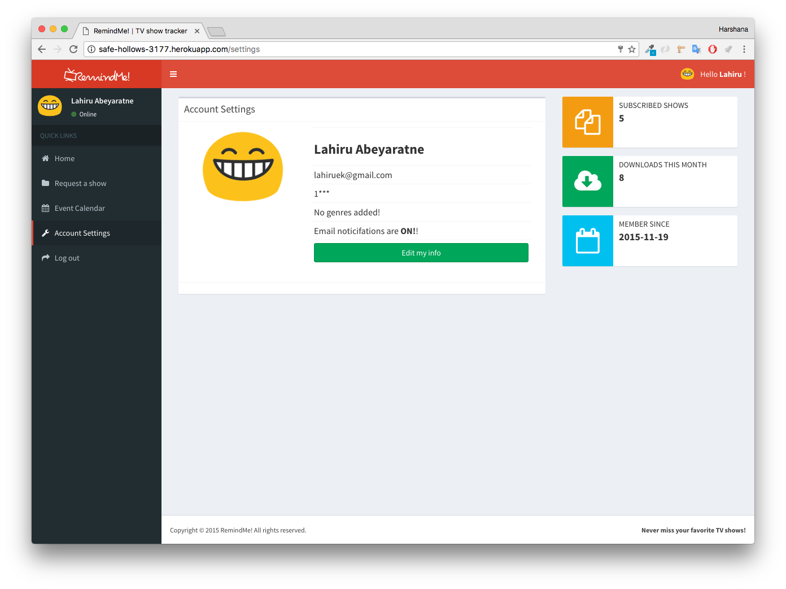

# TV-Show-Tracker
AngularJS, NodeJS and mongoDB based web application to track TV show episodes

“Remind Me!” is a TV show tracking service which allows users to subscribe and get notified whenever a new episode of their favorite TV Show is about to be aired. Uses TVDB and PopcornTV APIs.
  
<a href="http://safe-hollows-3177.herokuapp.com/"> DEMO </a>

  
FEATURES:  
1. Email notifications 
2. TV Show & episode info 
3. Download torrent links 
4. Personalized event calendar  
5. TV show suggestions 
6. Request new shows 
7. Edit user info
 
 
TODO LIST:  
1. Add a caching layer  
2. Encrypt passwords 
3. Add more features to admin 
4. Performance tweaks
